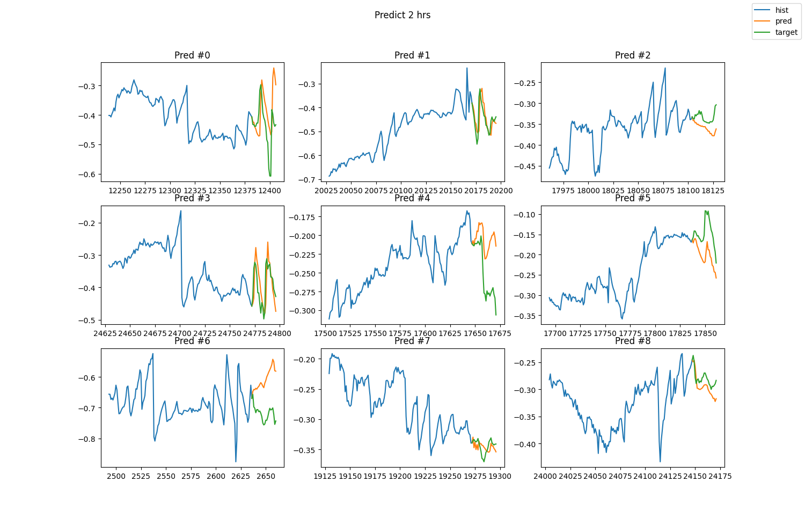

# Time Series Forecasting using RNN

Time series forecasting of imbalance in Norwegian power grid NO1 (South-East Norway) using Recurrent Neural Networks.

In all power grids there will be an imbalance between the power generated and the power consumed by users. This imbalance is difficult to predict, but if we know how much will be produced in a future time window, we can use neural networks to predict the imbalance in that time period.

This is achieved using Recurrent Neural Networks. RNNs are neural networks with an internal state. This way, they can better process data with variable input size or data changing over time, called time-series data. The data set used in this respository is a historical record of power grid imbalance and power production in the Norwegian power grid NO1. The data set contains measurements every five minutes in a time period of around two years. After training on part of this data, the recurrent neural network is set to predict two hours into the future using only power production data and time features.

## Results

When predicting 24 time steps (two hours) into the future, the model had quite good results. In the figure below, blue is the historical imbalance, yellow is the predicted future imbalance and green is the actual (ground truth) future imbalance. 

Most of the time it performs well while other times it is complete garbage. Sometimes it doesn't follow the trend but knows when a peak should appear, and sometimes it is the other way aournd. Generally, it is quite good.

More plots from models trained differently can be seen in [`plots/`](plots/).

## Usage

To run this program, download or clone the repository and run `imbalance_forecasting.py` using Python 3.9 or higher. As of writing this text, Tensorflow does not support Python 3.10 or higher.

### Download

Clone the project to any local directory. From there, the network class can be instantiated to create neural networks or the `test_images.py`-script can be run to test different neural networks on a generated data set.

## Requirements

- Python 3.9 or higher
- Tensorflow
- Numpy
- Matplotlib
- Pandas
- SciPy
- Scikit Learn
- Configparser

`pip install tensorflow numpy matplotlib pandas scipy scikit-learn configparser`

## Configuration

Most settings, such as which features to use or how long to train, can be changed in the config files. Examples for config files can be found in [`config/`](config/).

The syntax of the neural network config files is identical to Windows' .ini-files' syntax, where variables are defined on separate lines with an equals-sign separating the variable and the value.

In the __Globals__ section of the config we find the following settings:

- __model_name__: Name of the stored weights of the model
- __epochs__: How many epochs to train the network for
- __cols_to_use__: Which features to send to the network during and after training
- __steps__: How far into the past the network can see
- __amount_to_remove__: How many lines to remove at the beginning of the data
- __max_future_steps__: Maximum amount of steps to predict into the future
- __pred_start__: Where in the data set to start predictions during validation
- __hist_size__: Size of history plot during predictions
- __altered_forecasting__: Whether to perform altered forecasting (Forecasting on target  
    without structural imbalance)
- __randomize_y_prev__: Whether to randomize the very last y_prev-feature
- __randomize_plot_location__: Whether to star prediction at a random location in the data set

## License

This code is protected under the [GNU General Public License 3.0](http://www.gnu.org/licenses/gpl-3.0.html)